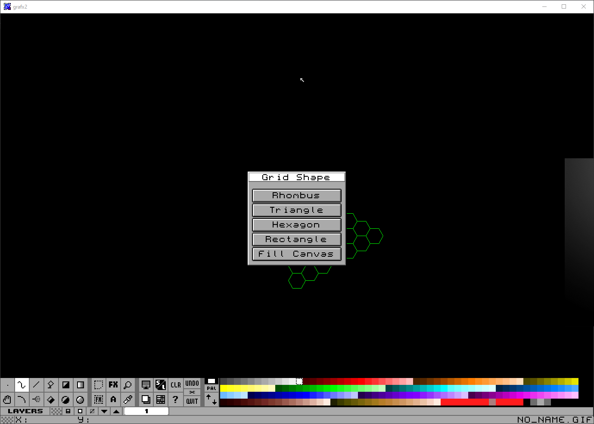
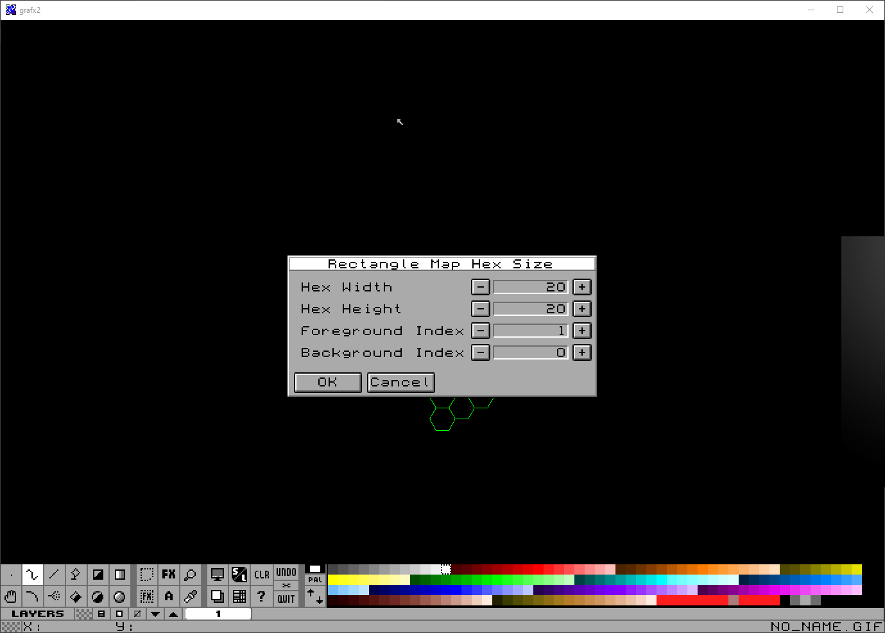
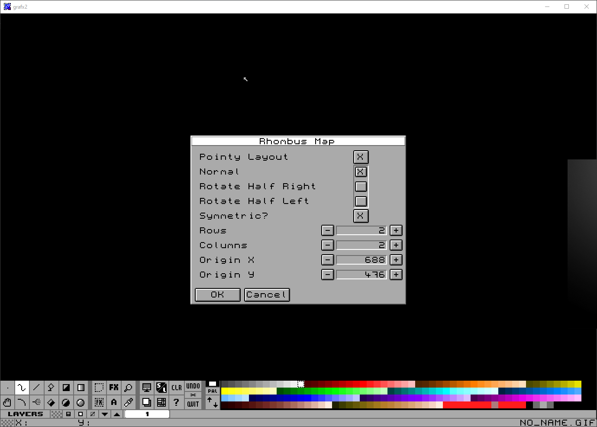
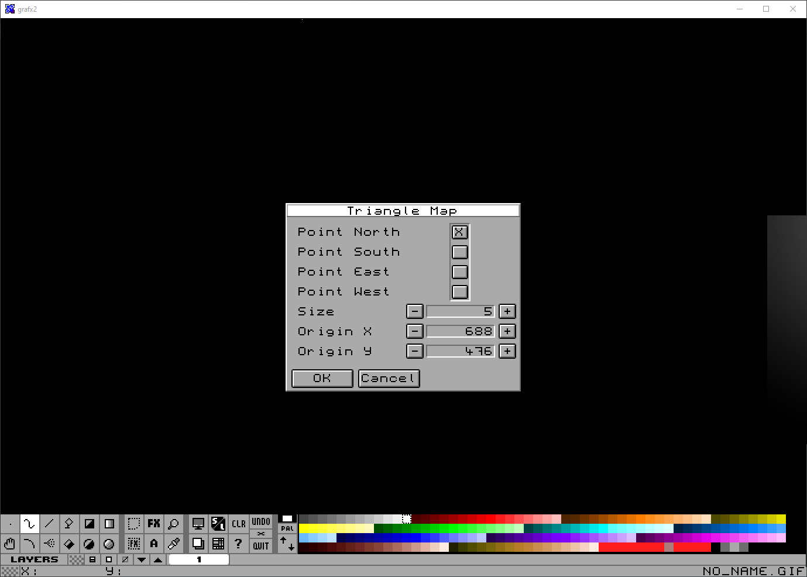
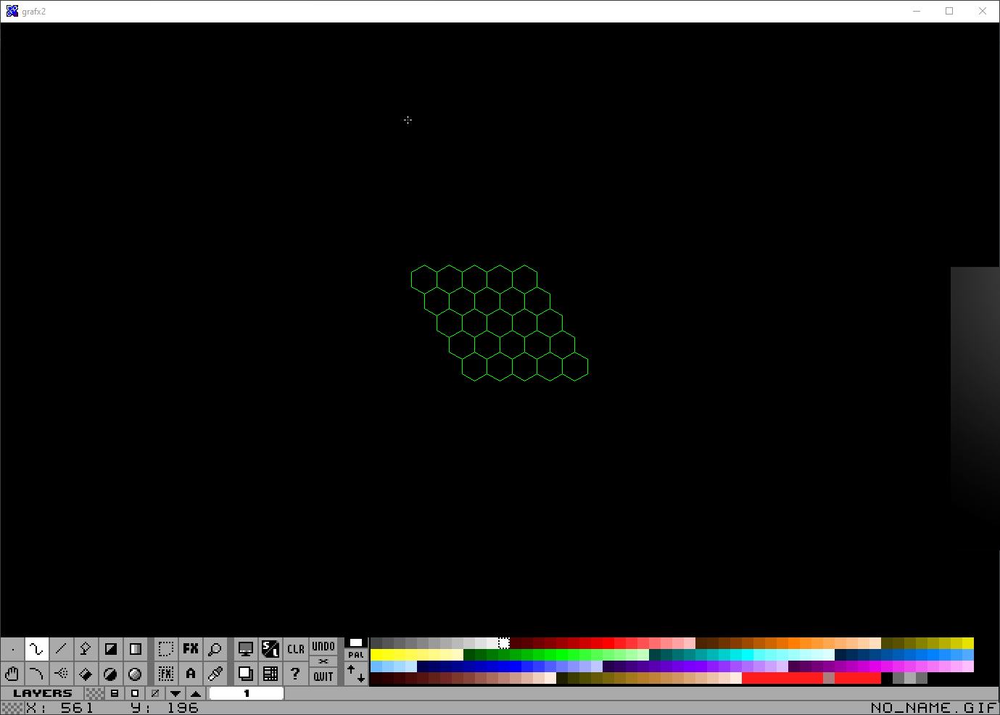

# Grafx2LuaScripts
Just some scripts to use in Grafx2's Brush Factory

## Selection Menu

## Size Menus are the same on each shape

## Each Shape has a pretty specific mapping control

## Which give you the results!

